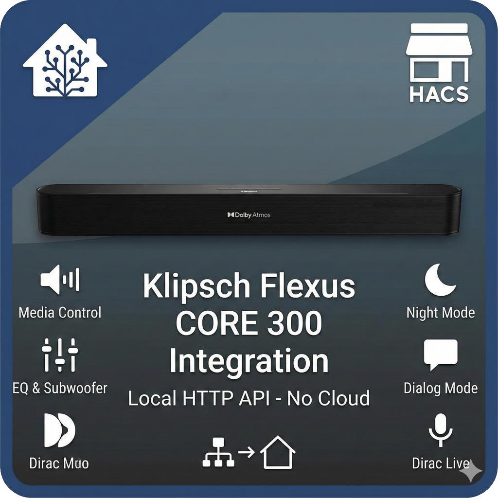

# Klipsch Flexus CORE 300

Home Assistant integration for **Klipsch Flexus CORE 300** (5.1.2-Channel Dolby Atmos Sound Bar).

Controls the soundbar via its native local HTTP API — no cloud, no delays.

## Features

### Media Player
- Volume control (set / step / mute)
- Power on / off (standby)
- Input source selection (TV ARC, HDMI, SPDIF, Bluetooth, Google Cast)
- Sound mode (Movie, Music, Game, Sport, Night, Direct, Surround, Stereo)
- Playback controls — play/pause, next/previous track
- Media metadata — title, artist, album, artwork, source app

### Channel Levels (Number Sliders, -6 to +6)
- **Bass / Mid / Treble** — tone controls
- **Front Height** — Dolby Atmos height channel
- **Side Left / Side Right** — surround sides
- **Back Left / Back Right** — surround rears
- **Back Height** — rear Atmos height channel
- **Subwoofer Wireless 1 / 2** — subwoofer levels

### Audio Settings (Select Entities)
- **EQ Preset** — Flat, Bass, Rock, Vocal
- **Night Mode** — Off / On
- **Dialog Mode** — Off / Level 1 / Level 2 / Level 3
- **Dirac Live** — room correction filter (filters auto-discovered from device)

### Diagnostics
- **Response Time** — API poll duration in ms with request counters
- **Device Status** — On / Standby / Offline with decoder and input info
- **Download diagnostics** — full device state from Settings → Devices → Klipsch Flexus

## Prerequisites

> **The soundbar must be already configured and working via the official Klipsch Stream app.**
>
> This integration communicates with the soundbar's local HTTP API, which is only available
> after the initial setup through the Klipsch Stream app (Wi-Fi configuration, firmware updates,
> speaker pairing, Dirac calibration, etc.).
>
> The integration does NOT replace the official app — it extends control into Home Assistant.

## Installation

### HACS (recommended)

1. Open HACS → Integrations → search **Klipsch Flexus**
2. Install and restart Home Assistant
3. Go to Settings → Devices & Services → **Add Integration** → Klipsch Flexus
4. Enter the soundbar's IP address

### Manual

1. Copy `custom_components/klipsch_flexus/` to your HA `config/custom_components/` directory
2. Restart Home Assistant
3. Add the integration via Settings → Devices & Services

## Configuration

| Parameter | Default | Description |
|-----------|---------|-------------|
| Host | — | IP address of the soundbar (required) |
| Poll interval | 15 s | Configurable via Options flow (5–120 s) |

**Tip:** Assign a static IP / DHCP reservation to the soundbar for reliable operation.

You can change the IP address later via **Reconfigure** (Settings → Devices → Klipsch Flexus → Configure).

## How It Works

The soundbar exposes a local HTTP API on port 80 with endpoints:
- `GET /api/getData` — read device parameters
- `GET /api/setData` — write device parameters
- `GET /api/getRows` — list structured data (Dirac filters)

### Slow Device Handling

The Klipsch Flexus has a **single-threaded HTTP server** that can only process one request at a time.
This integration includes several mechanisms to ensure reliable operation:

- **Request serialization** — all API calls are serialized via `asyncio.Lock`
- **Retry with backoff** — transient errors are retried (2 attempts, 0.5 s delay)
- **Adaptive timeouts** — 8 s for reads, 10 s for writes, 15 s for power commands
- **Graceful degradation** — failed parameter reads fall back to last-known cached values
- **Optimistic updates** — UI reflects changes immediately, confirmed via delayed poll

## Entities Created

| Entity | Type | Category | Description |
|--------|------|----------|-------------|
| `media_player.klipsch_flexus_core_300` | Media Player | — | Main control entity |
| `1. Night Mode` | Select | Config | Night mode on/off |
| `2. Dialog Mode` | Select | Config | Dialog enhancement level |
| `3. EQ Preset` | Select | Config | Equalizer preset |
| `4. Dirac Filter` | Select | Config | Dirac Live room correction |
| `Channel: Back Height` | Number | Config | Back height level (-6..+6) |
| `Channel: Back Left` | Number | Config | Back left level (-6..+6) |
| `Channel: Back Right` | Number | Config | Back right level (-6..+6) |
| `Channel: Front Height` | Number | Config | Front height level (-6..+6) |
| `Channel: Side Left` | Number | Config | Side left level (-6..+6) |
| `Channel: Side Right` | Number | Config | Side right level (-6..+6) |
| `Channel: Subwoofer Wireless 1` | Number | Config | Sub 1 level (-6..+6) |
| `Channel: Subwoofer Wireless 2` | Number | Config | Sub 2 level (-6..+6) |
| `Tone: Bass` | Number | Config | Bass level (-6..+6) |
| `Tone: Mid` | Number | Config | Mid level (-6..+6) |
| `Tone: Treble` | Number | Config | Treble level (-6..+6) |
| `Status: Response Time` | Sensor | Diagnostic | API poll time in ms |
| `Status: Device` | Sensor | Diagnostic | On / Standby / Offline |

## Troubleshooting

- **Cannot connect** — check that the soundbar is on the same network and responds to `http://<IP>/api/getData?path=player:volume&roles=value`
- **Entities unavailable** — the soundbar is single-threaded; if the Klipsch app is polling simultaneously, HA may time out. Close the app and retry
- **Slow updates** — increase the poll interval in Options if the soundbar struggles
- **Download diagnostics** — Settings → Devices → Klipsch Flexus → 3-dot menu → Download diagnostics. Attach to bug reports

## Known Limitations

- Only one soundbar per integration entry (add multiple via separate entries)
- No support for multi-room / wireless surround speaker group management (use Klipsch Stream app)
- AirPlay and Cast protocols are not used — only the native HTTP API on port 80
- The soundbar must be set up initially via the official Klipsch Stream app

## License

MIT — see [LICENSE](LICENSE).
